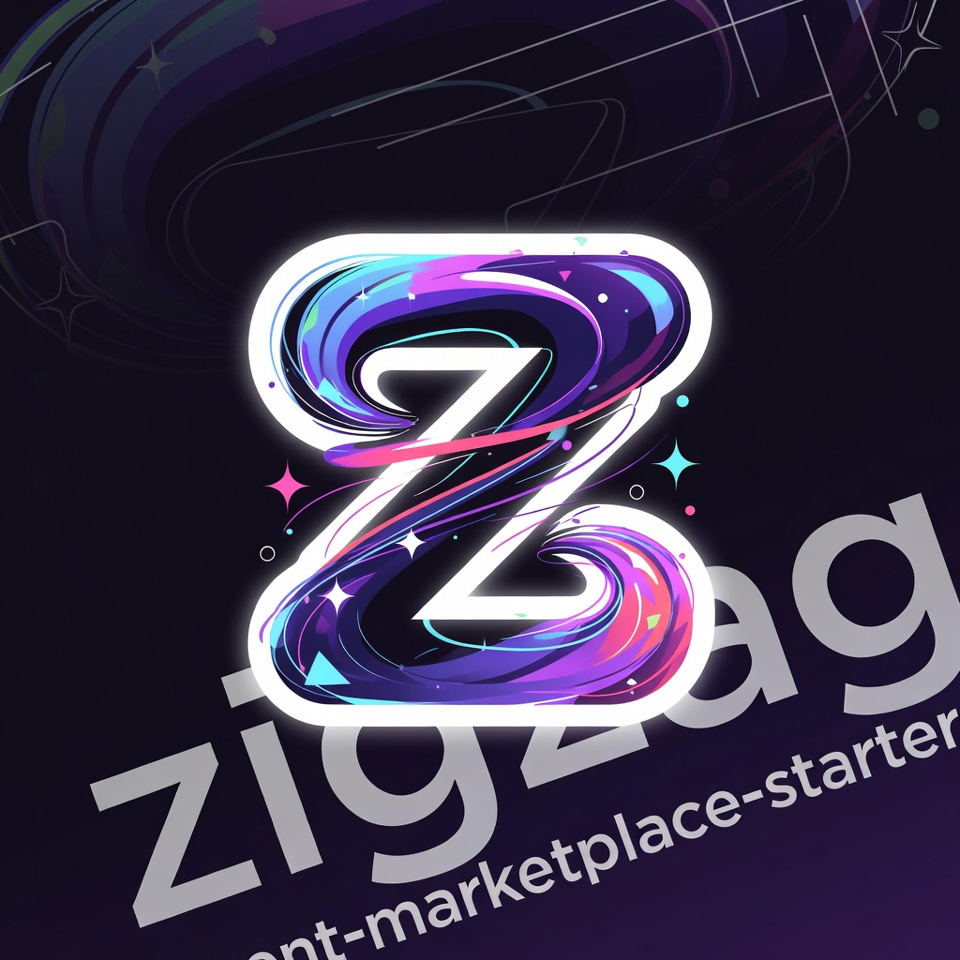

# Agent Marketplace Starters



Production-ready templates for building agent marketplaces — the hard parts, solved.

[](https://www.typescriptlang.org/)
[](https://nextjs.org/)
[](https://modelcontextprotocol.io/)
[](https://x402.org/)

## Why This Exists

The [official MCP quickstart](https://github.com/modelcontextprotocol/quickstart-resources) shows you how to build a standalone Python or Node server. It doesn't show you:

- How to embed an MCP endpoint **inside your existing Next.js app** (not a separate process)
- How to register agents with **cryptographic ownership proofs** (wallet signatures)
- How to charge for agent usage with **multi-chain payments** (Base, Solana, Sui, NEAR)
- How to let agents **declare their own UI** and have the marketplace render it automatically
- How to proxy MCP calls between your marketplace and external agent endpoints

These templates extract the battle-tested patterns from production agent marketplaces.

## Templates

| Template | What It Solves | Deploy Target |
|----------|---------------|---------------|
| [`mcp-http-nextjs`](templates/mcp-http-nextjs/) | MCP endpoint as a Next.js API route | Vercel |
| [`agent-registration`](templates/agent-registration/) | Crypto-verified agent signup + discovery API | Vercel + PostgreSQL |
| [`x402-payments`](templates/x402-payments/) | Multi-chain payment flow with x402 | Vercel |
| [`ui-manifest`](templates/ui-manifest/) | Declarative agent UI schema + renderer | Vercel |

## Quick Start

```bash
# Clone the repo
git clone https://github.com/your-org/agent-marketplace-starters.git
cd agent-marketplace-starters

# Pick a template
cd templates/mcp-http-nextjs
npm install
npm run dev
```

## Architecture Philosophy

Each template follows these principles:

1. **In-process over separate process** — MCP endpoints live in your app, not a sidecar
2. **Wallet-native identity** — Agents are owned by wallets, not email/password
3. **Payment at the protocol layer** — x402 means payments happen in the request flow, not a separate checkout
4. **Declarative UI** — Agents describe their interface; the marketplace renders it
5. **Type-safe throughout** — Zod schemas at every boundary

## Comparison

| Resource | Scope | Best For |
|----------|-------|----------|
| **MCP Official Quickstart** | Standalone stdio/SSE servers | Learning MCP basics |
| **chrono-warp-drive template** | Hono SSE + Streamable HTTP | Railway-deployed MCP tools |
| **These starters** | Next.js Streamable HTTP (in-process) | Production agent platforms |

> **Streamable HTTP** is the recommended MCP transport for web-deployed agents. It uses direct JSON-RPC 2.0 over HTTP POST (no SSE, no separate process). Grok CLI, Claude, and Cursor all support it natively. Configure with `url = "https://your-app/api/mcp"` — no `/sse` suffix needed.

## Contributing

These templates extract patterns from production systems. If you've solved one of these problems differently, open a PR with your approach.

## License

MIT
